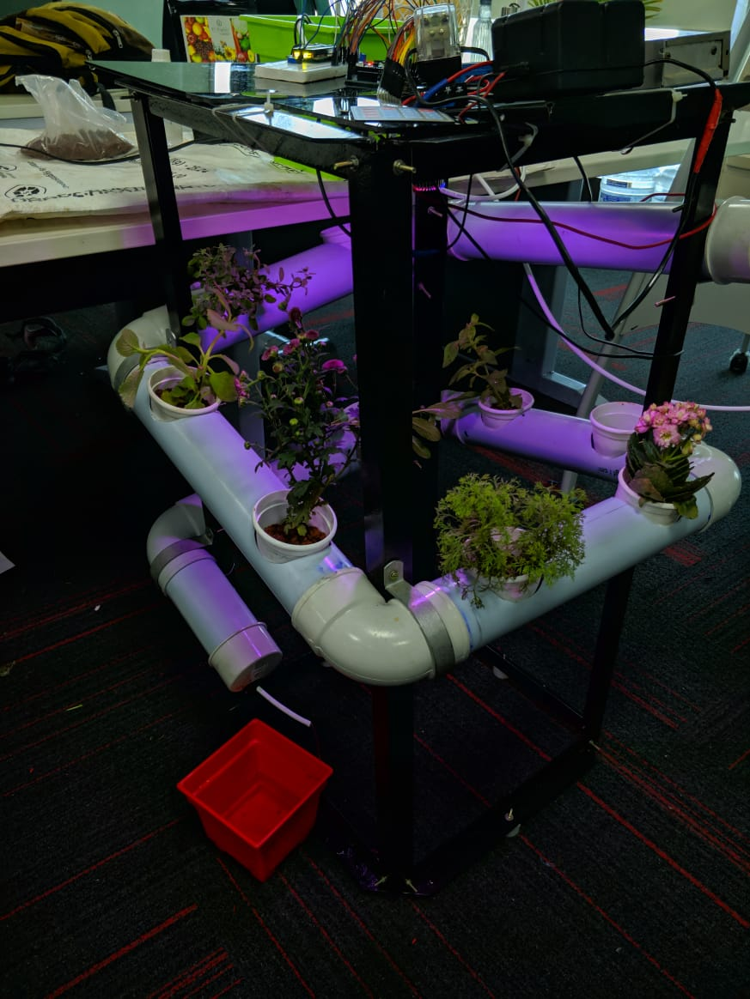
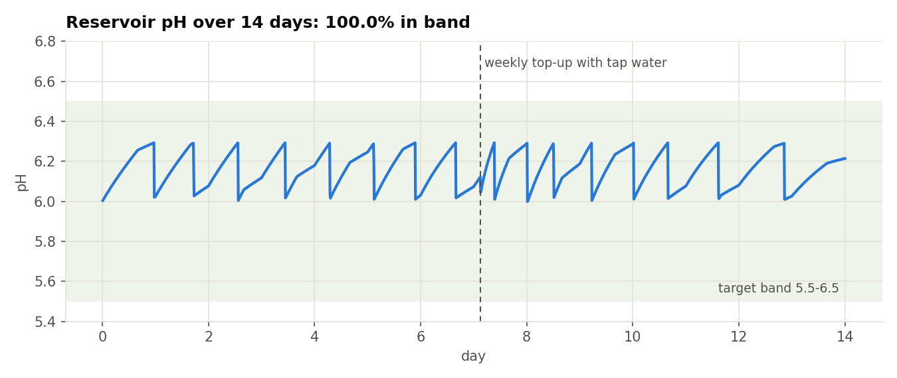
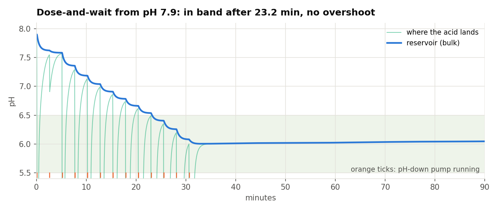
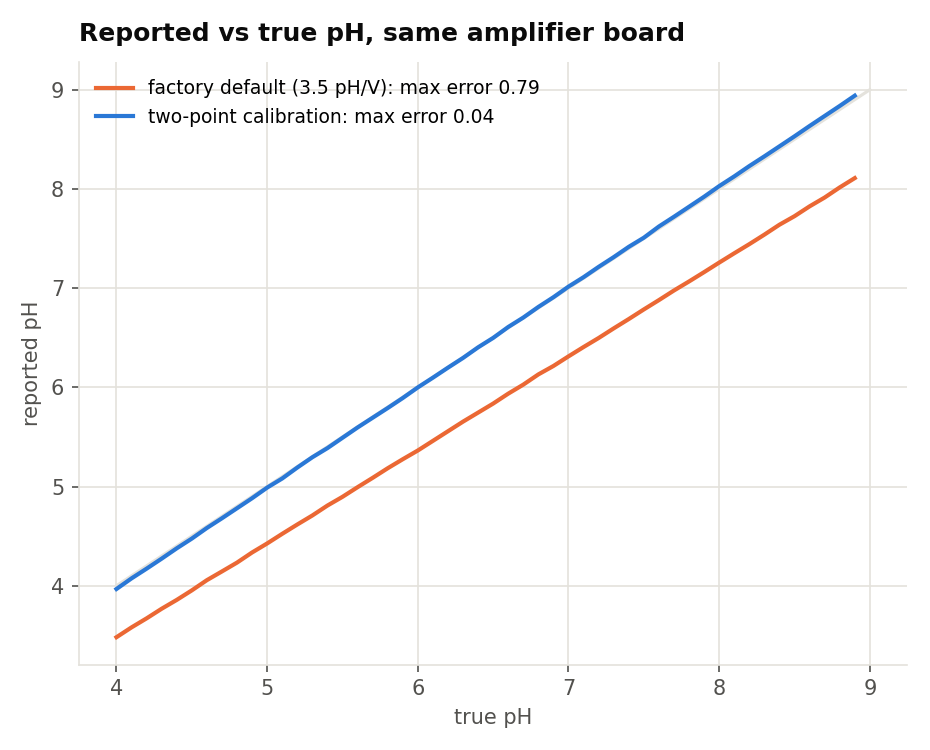

# Hydroponinator

An automated hydroponics controller for the Arduino Mega 2560: firmware that keeps a soil-free grow rack's nutrient solution at the right pH, runs the lights, pump and climate on a schedule, and protects itself when sensors fail. It comes with a simulator that runs the real firmware against a model of the reservoir, and an interactive site that explains the whole system from the chemistry up.

**Live site:** https://sundarrajnitish.github.io/Automated-Hydroponics-Lab/



The rack is an NFT system: a pump lifts nutrient solution from a 12-litre reservoir to the top of angled PVC channels, it flows past the roots and drains back. The controller has a 4×4 keypad and a 16×2 LCD, reads a pH probe, a DHT11 and a water-level strip, and switches the circulation pump, a grow light, fluorescent tubes, a fan, a humidifier, and two small dosing pumps (pH-down and nutrient).

## Results

From `python -m hydrolab`, which drives the compiled firmware through scripted scenarios on the simulated rig:

| | |
|---|---|
| pH inside 5.5-6.5 over a 14-day grow | **100 %** (6.00-6.32), 21 automatic corrections |
| Tank filled with hard tap water (pH 7.9) | back in band in **23 min**, 13 doses, no overshoot |
| Energy over 14 days | **26.1 kWh** (16 h light, pump cycled 13.4 h/day) |
| Probe amplifier stuck high | **0 mL** dosed, PH PROBE FAULT within 12 s |
| Probe frozen at a believable reading | dosing halted after **76 mL** |
| Tank left to evaporate | pump locked out at 21.8 % water, **0 h** dry running |
| Keys pressed while the controller is dosing | **60 of 60** seen, worst `loop()` pass 24 ms |
| pH error after two-point calibration | **0.04** pH across 4-9 (0.79 with the factory conversion) |





## How the firmware works

[`firmware/Hydroponics/`](firmware/Hydroponics/)

**Hardware layer (`Hydroponics.ino`).** Never blocks: it samples pH every 100 ms (sort ten samples, average the middle six), the level strip every 500 ms and the DHT11 every 2 s; it rewrites only the LCD characters that changed; it prints CSV telemetry every 5 s; and a 4 s watchdog reboots a hung board into its last program. Every output is parked at OFF before it becomes an output, with per-channel relay polarity in `config.h`.

**Controller (`src/hydro_core.*`).** Plain C++ with no Arduino calls, unit-tested on a PC:

- **pH measurement**: median of five one-second readings; two-point calibration (pH 7 and pH 4 buffers) with a stability check and slope limits, stored in EEPROM with a CRC-8; readings at an ADC rail or above pH 9 are treated as sensor faults.
- **Dose-and-wait**: corrections start above pH 6.3 and aim for 6.0. Each dose is sized from the tank's learned response and aimed 20 % short, then the pump circulates for 150 s before the result is judged and the response estimate updated. Three doses with no effect lock dosing out until the operator acknowledges; there is also a daily pH-down allowance.
- **Schedule**: 16 h photoperiod; pump 15 min on / 15 off by day and 15 / 45 at night; economy mode with 12 h of grow light only and longer pump rests.
- **Protection**: low-water interlock with hysteresis (an unknown level counts as low), fan and humidifier hysteresis control that fails safe when the DHT11 goes quiet, manual dosing pumps that switch themselves off after 10 s.

It builds for the ATmega2560 at 21.4 KB of flash and 1.7 KB of RAM.

### Keys

| Key | Action |
|---|---|
| A / D | automatic / economy program (also acknowledges a dosing lock-out) |
| B | manual: 1/4 pump on/off, 2/5 nutrient, 3/6 pH-down, 7/* fan, 8/0 fluorescent, 9/# grow light |
| C | monitor pages; then # next page, * set clock (HHMM, #), 0 calibrate the pH probe |

**Calibrating:** C, 0, probe in pH 7 buffer, wait for `#=OK`, press #; probe in pH 4 buffer, wait, press #; rinse and return the probe to the tank.

### Wiring

| Pin | Part | On when |
|---|---|---|
| D10 | circulation pump (relay) | LOW |
| D11 | pH-down pump (transistor) | HIGH |
| D12 | nutrient pump (transistor) | HIGH |
| D13 | grow light (relay) | LOW |
| D14 | fluorescent tubes (relay) | LOW |
| D15 | fan (relay) | LOW |
| D16 | humidifier (transistor) | HIGH |
| A0 / A1 / A2 | DHT11 / pH amplifier / level strip | |
| 43-53, 2-9 | LCD (RS, E, D4-D7), keypad rows and columns | |

### Flashing

Arduino IDE or `arduino-cli`, board **Arduino Mega 2560**, libraries **Keypad** (Mark Stanley, Alexander Brevig), **DHTlib** (Rob Tillaart) and **LiquidCrystal**. Open `firmware/Hydroponics/Hydroponics.ino`.

## The simulator

[`sim/`](sim/) is C++: a mock Arduino core (`digitalWrite`, `analogRead`, `millis`, LCD, keypad, DHT11, EEPROM, watchdog, each costing the time it costs on a Mega) on top of a model of the room and reservoir: phosphate and carbonate chemistry with slow CO₂ exchange, two-zone mixing, electrode lag, ADC noise, evaporation, a daily climate cycle and a growth index. The firmware compiles into it unmodified.

The same sources build natively (for Python and the tests) and to WebAssembly (for the site). With FMA contraction off and a small deterministic maths library, both builds give bit-identical results; `tests/test_parity.py` checks it.

The model's parameters are plausible for a small indoor rig rather than measured, so read the results as the controller's behaviour under realistic, repeatable conditions, not as agronomy.



## Repository

```
firmware/Hydroponics/   the sketch, config.h, src/hydro_core.* (controller)
firmware/test/          host unit tests for the controller (make)
sim/                    virtual board, reservoir model, mock Arduino core, C API
hydrolab/               Python: ctypes bindings, scenarios, figures (python -m hydrolab)
tests/                  pytest: firmware behaviour on the virtual rig, chemistry, native/wasm parity
docs/                   the interactive site (GitHub Pages, served from /docs)
results/findings.json   numbers behind the table above
```

## Running it

```sh
make -C firmware/test          # controller unit tests (ASan + UBSan, randomised invariants)
pip install -r requirements.txt
pytest                         # builds sim/ on first use
python -m hydrolab             # all scenarios -> results/, docs/data/, media/figures/
make -C sim web                # rebuild the WebAssembly for the site (clang + wasm-ld)
python -m http.server -d docs  # then open http://localhost:8000
```

## Author

Designed and built by **Nitish Sundarraj**. MIT licence.
